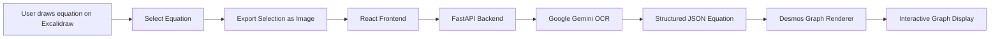
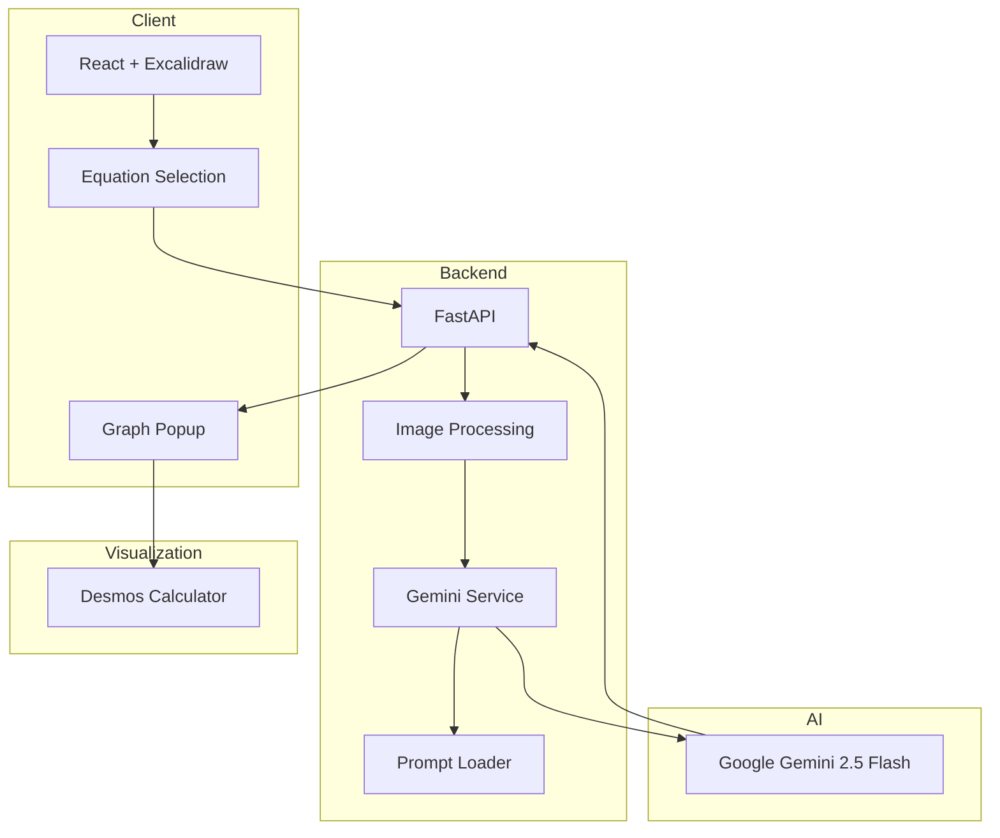
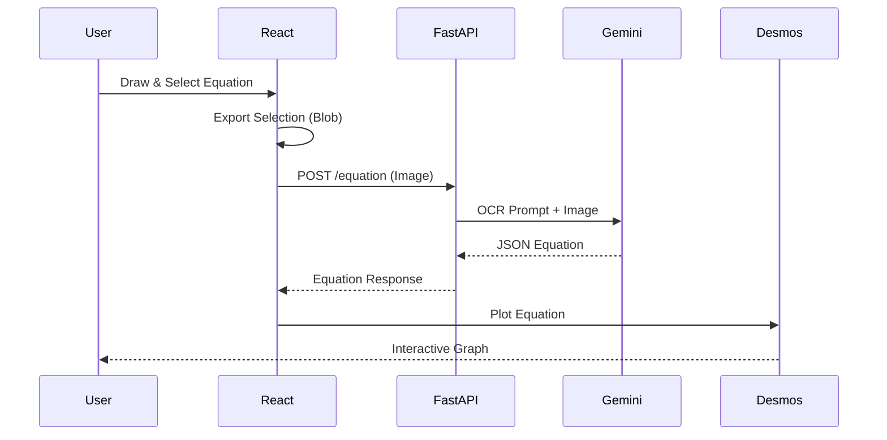

# 🧠 SmartBoard — AI Powered Math Whiteboard

Turn handwritten mathematical equations into interactive graphs instantly.

**Live Demo:** https://ai-smart-board.vercel.app

---

## 🚀 Overview

SmartBoard is an AI-powered digital whiteboard built for students and educators. Draw equations naturally on an Excalidraw canvas, select the equation, and SmartBoard converts it into a graph using **Google Gemini** for mathematical OCR and **Desmos** for visualization.

The goal is to make solving and visualizing mathematics feel as seamless as writing on paper.

### ✨ Features

* ✍️ Handwritten equation recognition.
* 🤖 AI-powered mathematical OCR using Google Gemini.
* 📈 Instant graph generation using Desmos.
* 🎯 Select only a portion of the whiteboard for graphing.
* ⚡ FastAPI backend with image processing.
* 🌐 Responsive React frontend.
* ☁️ Deployed with Vercel (Frontend) and Render (Backend).

---

# 🌍 Live Application

| Service                  | URL                                          |
| ------------------------ | -------------------------------------------- |
| **Frontend (Vercel)**    | https://ai-smart-board.vercel.app/smartboard |
| **Backend API (Render)** | Render                                       |

---

# 📸 Preview


https://github.com/user-attachments/assets/e48cbc12-f1ce-418c-9d90-21a62ad72711


---

# 🏗️ Tech Stack

## Frontend

* React.js, react-router-dom
* Vite
* Excalidraw
* Framer Motion , CSS

## Backend

* FastAPI
* Python 3.12
* Google Gemini 2.5 Flash API
* Uvicorn

## AI & Visualization

* Google Gemini (Mathematical OCR)
* Desmos Graphing Calculator

## Deployment

| Platform | Purpose         |
| -------- | --------------- |
| Vercel   | React Frontend  |
| Render   | FastAPI Backend |

---

# 🧩 Project Architecture

```text
SmartBoard/
│
├── frontend/
│   ├── src/
│   ├── components/
│   ├── pages/
│   ├── assets/
│   └── App.jsx
│
├── backend/
│   ├── routes/
│   ├── services/
│   ├── utils/
│   │   └── prompts/
│   ├── main.py
│   └── requirements / pyproject.toml
│
└── README.md
```

---

# 🔄 Application Flow Diagram



### Flow Explanation

1. User writes an equation on the whiteboard.
2. User selects only the equation.
3. Excalidraw exports the selected region as an image.
4. React sends the image to FastAPI.
5. FastAPI forwards the image to Gemini.
6. Gemini extracts the mathematical expression as JSON.
7. React receives the equation.
8. Desmos renders the graph instantly.

---

# 🏛️ High-Level Architecture Diagram



---

# ⚙️ Backend Processing Pipeline


Gemini is instructed to return **only valid JSON** containing:

* equation
* latex
* sympy
* variable
* graphable

This makes the frontend independent of OCR formatting.

---

# 📦 Local Development

## Clone Repository

```bash
git clone https://github.com/<your-username>/smartboard.git

cd smartboard
```

## Frontend

```bash
cd frontend

npm install

npm run dev
```

Runs on:

```text
http://localhost:5173
```

## Backend

```bash
cd backend

uv sync

uvicorn main:app --reload
```

Runs on:

```text
http://localhost:8000
```

---

# 🌐 Environment Variables

## Frontend (`.env`)

```env
VITE_BACKEND_URL=http://localhost:8000
```

For production:

```env
VITE_BACKEND_URL=https://your-render-backend.onrender.com
```

## Backend (`.env`)

```env
GOOGLE_API_KEY=your_google_gemini_api_key
```

Never commit `.env` files.

---

# 🚀 Deployment

## Frontend — Vercel

* Framework: Vite
* Root Directory: `frontend`
* Environment Variable:

```env
VITE_BACKEND_URL=https://your-render-backend.onrender.com
```

## Backend — Render

* Runtime: Python
* Build Command

```bash
uv sync --frozen && uv cache prune --ci
```

* Start Command

```bash
uvicorn main:app --host 0.0.0.0 --port $PORT
```

---

# 📁 Tech Behind SmartBoard

<table><table-section header><table-row header><table-cell header>Component</table-cell><table-cell header>Technology</table-cell></table-row></table-section><table-row><table-cell>Whiteboard</table-cell><table-cell>Excalidraw</table-cell></table-row><table-row><table-cell>OCR Engine</table-cell><table-cell>Google Gemini 2.5 Flash</table-cell></table-row><table-row><table-cell>Graph Engine</table-cell><table-cell>Desmos</table-cell></table-row><table-row><table-cell>Frontend</table-cell><table-cell>React + Vite</table-cell></table-row><table-row><table-cell>Backend</table-cell><table-cell>FastAPI + Python</table-cell></table-row><table-row><table-cell>Deployment</table-cell><table-cell>Vercel + Render</table-cell></table-row></table>

---

# 🎯 Use Cases

* Students learning Algebra and Calculus.
* Teachers explaining equations interactively.
* Digital note-taking with instant visualization.
* Online tutoring.
* Tablet-based handwritten mathematics.

---

# 🔮 Future Improvements

* Graph customization (colors, domains, ranges).
* Save whiteboard sessions.
* Export graph as PNG/PDF.
* AI explanation of graphs.
* Mobile and tablet optimized UI.
* Multi-equation graph plotting.

---

# 👨‍💻 Author

## Keerthivardhan Tekulapelli

 Engineer | • AI • AWS • Python • FastAPI • React

**LinkedIn:** *[Add your LinkedIn URL](https://www.linkedin.com/in/keerthi-vardhan-tekulapelli-7064a6245/)*
**Email:** *keerthivardhantekulapelli@gmail.com*

---

# ⭐ Support the Project

If you found SmartBoard useful, consider giving the repository a **Star ⭐** on GitHub. It helps others discover the project and supports future development.
